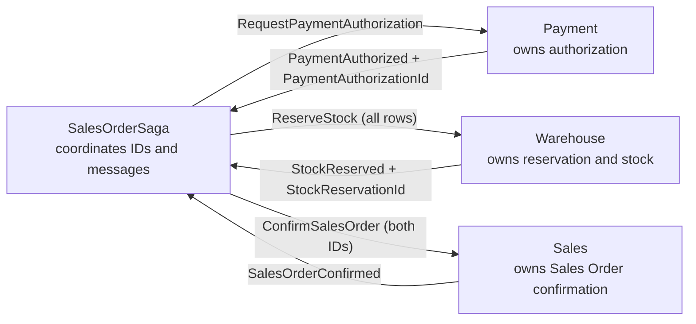

# BrewUp Order Confirmation Architecture

## Paradigm and inherited invariants

The feature extends BrewUp's domain-driven modular monolith using CQRS and
event-sourced owning aggregates. RabbitMQ carries integration messages,
EventStore persists aggregate streams, and MongoDB holds rebuildable
projections. These are existing repository choices, not new feature decisions.

Inherited invariants:

- BC-000 through BC-011 fix Sales, Payment, and Warehouse authority and the
  evidence required for confirmation.
- AR-000 through AR-018 fix module structure, contract placement, dependency
  direction, host/solution composition, testing, and saga authority.

The approved input
`docs/superpowers/specs/2026-07-27-brewup-order-confirmation-with-bmad-harness-design.md`
adopts the feature decisions used below. In particular, its **Confirmed Domain
Decisions** section resolves all-or-nothing reservation,
post-authorization reservation failure without compensation, and coordination
by the existing `SalesOrderSaga` in Payment -> Warehouse -> Sales order. The
architecture does not infer those decisions from BC-011.



## Architecture decisions

### AD-1 [ADOPTED] — State changes remain owned, event-sourced decisions

**Binds:** Payment, Warehouse, Sales, and Sagas domain implementations.

**Prevents:** Application handlers, ACLs, endpoints, or the saga from making
domain decisions owned by an aggregate.

**Rule:** Commands load the owning aggregate, call one domain behavior, and
save it. Payment alone records authorization, Warehouse alone decides complete
reservation, and Sales alone transitions a Sales Order to `Confirmed`.

Traceability: BC-001 through BC-008; AR-008; AR-018; FR-001 through FR-015.

### AD-2 [ADOPTED] — Cross-context evidence is explicit and referential

**Binds:** SharedKernel contracts, integration events, saga state, and Sales
Order state.

**Prevents:** Embedded Payment/Warehouse models and direct cross-module Domain
or Infrastructure access.

**Rule:** Payment owns `PaymentAuthorizationId`; Warehouse owns
`StockReservationId`. The saga carries both IDs, and Sales stores only those
external references. Cross-context traffic uses SharedKernel messages,
integration events, ACL handlers, or module facades.

Traceability: BC-002; BC-004; BC-006; BC-009; BC-010; AR-004 through AR-007;
AR-015 through AR-018; FR-009; FR-013; FR-018.

### AD-3 [ADOPTED] — Payment is a complete standard module

**Binds:** Physical placement, solution membership, host registration, and
Payment ownership.

**Prevents:** Partial module creation, alternative project names, or Payment
behavior placed in Sales.

**Rule:** Payment uses exactly these six projects:

```text
src/Payment/BrewUp.Payment.SharedKernel/BrewUp.Payment.SharedKernel.csproj
src/Payment/BrewUp.Payment.Domain/BrewUp.Payment.Domain.csproj
src/Payment/BrewUp.Payment.ReadModel/BrewUp.Payment.ReadModel.csproj
src/Payment/BrewUp.Payment.Infrastructure/BrewUp.Payment.Infrastructure.csproj
src/Payment/BrewUp.Payment.Facade/BrewUp.Payment.Facade.csproj
src/Payment/BrewUp.Payment.Tests/BrewUp.Payment.Tests.csproj
```

All six belong under a `/50 Modules/Payment/` solution folder in
`src/BrewUp.slnx`. `src/BrewUp.Rest/Module/PaymentModule.cs` composes the
Facade through `IModule`; the REST host contains no Payment business logic.
Payment needs no optional Entities project for this increment.

Traceability: BC-003; BC-004; AR-001 through AR-005; AR-008 through AR-016;
FR-001; FR-016; FR-017.

### AD-4 [ADOPTED] — Project references obey one-way layer boundaries

**Binds:** All new and modified `.csproj` files and architecture fitness tests.

**Prevents:** Circular layer coupling, infrastructure in Domain, and direct
access to another bounded context's implementation.

**Rule:** Allowed directions are:

```text
Facade         -> Domain, ReadModel, Infrastructure, SharedKernel
Domain         -> SharedKernel
ReadModel      -> SharedKernel
Infrastructure -> Domain, SharedKernel
Tests          -> owned layers as needed
REST host      -> module Facade only
```

Sales, Warehouse, Payment, and Sagas may reference another module's
SharedKernel contracts when required, but never another module's Domain or
Infrastructure. New code must not depend on any pre-existing nonconforming
project-reference edge.

Traceability: AR-015 through AR-017; FR-018; NFR-001.

### AD-5 [ADOPTED] — Payment authorization has a pending-to-authorized boundary

**Binds:** Payment SharedKernel, Domain, Facade callback, projection, and
integration publication.

**Prevents:** The saga or endpoint manufacturing an outcome, duplicate
authorization, and unapproved provider policy.

**Rule:** `RequestPaymentAuthorization` carries a stable
`PaymentAuthorizationId` and Sales Order reference; Payment retains both and
creates one pending `PaymentAuthorization`. Replaying the same stable request is
a no-op. The correlation ID remains command/event metadata used for message
flow and is not retained as aggregate business state. The simulated provider calls
`POST /v1/payment/authorizations/{authorizationId}/authorized` with a provider
reference; the Facade sends `RecordPaymentAuthorized`; the aggregate alone
emits `PaymentAuthorized`. A duplicate authorized outcome is a no-op.
No amount/currency, real provider, decline, timeout, retry, void, or refund
behavior is introduced.

Traceability: BC-003; BC-004; BC-008; BC-011; AR-004 through AR-008; FR-001
through FR-004; AC4; AC5.

### AD-6 [ADOPTED] — Warehouse reservation is all-or-nothing

**Binds:** Warehouse contracts, ACL availability-data enrichment,
`StockReservation` aggregate decision, outcome projection, and availability
projection.

**Prevents:** Partial reservation, early success/failure before all rows are
assessed, duplicate reservation, or Sales becoming stock authority.

**Rule:** The Warehouse ACL queries the Warehouse-owned availability projection
for every row in order, attaches the factual available quantity without early
return, and submits one complete `ReserveStock` command. The ACL makes no
availability or reservation policy decision. The `StockReservation` aggregate
groups requested quantities by the canonical key
`(WarehouseId, BeerId, UnitOfMeasure)`, compares each cumulative total against
one Warehouse-owned availability fact, retains the original ordered rows for
the outcome, and emits either one `StockReserved` containing all rows and
`StockReservationId`, or one `StockReservationFailed` with no reserved rows.
A duplicate stable reservation ID is a no-op.

Traceability: BC-005 through BC-008; AR-007 through AR-010; AR-017; FR-005
through FR-008; AC2; AC5.

### AD-7 [ADOPTED] — Sales confirmation is an evidence gate

**Binds:** Sales command/event contracts, Sales Order aggregate, projection,
and confirmation integration event.

**Prevents:** Evidence-free confirmation, embedded external models, and
duplicate confirmation.

**Rule:** `ConfirmSalesOrder` carries nullable `PaymentAuthorizationId` and
`StockReservationId`. `SalesOrder.Confirm()` rejects either missing ID, stores
both IDs on success, emits one `SalesOrderConfirmed`, and transitions once to
`Confirmed`. Reconfirmation after `Confirmed` is a no-op.

Traceability: BC-001; BC-002; BC-004; BC-006; BC-009; BC-010; FR-009 through
FR-012; AC1; AC5.

### AD-8 [ADOPTED] — The saga enforces one coordination order

**Binds:** SalesOrderSaga state, saga-owned events, integration handlers,
downstream command publication, and the existing
availability-to-`AcceptSalesOrder` shortcut registration.

**Prevents:** Stock reservation before authorization, confirmation before
reservation, continued availability-to-`AcceptSalesOrder` routing in this
confirmation flow, compensation invention, and duplicate downstream actions.

**Rule:** Preserve current budget verification and order placement, then run:

```text
RequestPaymentAuthorization
  -> PaymentAuthorized
  -> ReserveStock (every order row)
  -> StockReserved
  -> ConfirmSalesOrder (PaymentAuthorizationId, StockReservationId)
  -> SalesOrderConfirmed
  -> saga completed
```

On `StockReservationFailed`, persist a terminal saga failure, keep the recorded
authorization ID, leave the Sales Order unconfirmed, and emit no confirm, void,
refund, retry, release, timeout, notification, or expiry action. Aggregate and
saga state guards make replayed outcomes no-ops. Disconnect
`SagaSalesOrderAvailabilityCheckedIntegrationEventHandler` (or its exact
brownfield equivalent) from this confirmation flow; do not delete unrelated
legacy contracts without compilation evidence.

Traceability: BC-003 through BC-011; AR-017; AR-018; FR-013 through FR-015;
AC3 through AC5.

### AD-9 [ADOPTED] — Projections report outcomes; they do not decide them

**Binds:** Payment, Warehouse, and Sales ReadModel event handlers and query
services.

**Prevents:** MongoDB/read-model state becoming domain authority or a
projection update manufacturing an outcome.

**Rule:** Payment projects pending/authorized state. Warehouse keeps on-hand
availability unchanged by reservation projection handlers, projects successful
reservations separately, and computes remaining availability in the query as
on-hand minus active successful reservation quantities exactly once; failed
reservations contribute zero. Sales projects confirmed status and both external
evidence IDs. Projections are rebuildable from events and may be eventually
consistent.

Traceability: BC-003 through BC-010; AR-009; FR-003; FR-007; FR-010; NFR-003.

### AD-10 [ADOPTED] — Tests prove behavior, placement, and boundaries

**Binds:** Story test-first order, test project placement, and release
verification.

**Prevents:** Implementing unverified behavior or satisfying examples while
violating the module architecture.

**Rule:** Each behavior begins with a failing specification or saga test.
Tests live at:

```text
src/Payment/BrewUp.Payment.Tests/Domain/
src/Payment/BrewUp.Payment.Tests/Architecture/
src/Warehouse/BrewUp.Warehouse.Tests/Domain/
src/Sales/BrewUp.Sales.Tests/Domain/
src/Sagas/BrewUp.Sagas.Tests/Orchestrators/
src/BrewUp.Rest.Tests/Architecture/
```

Payment architecture fitness tests cover six-project existence, solution
membership, contract placement, host registration, allowed/forbidden
references, and absence of Sales/Warehouse Domain or Infrastructure references.
Payment domain specifications include
`DoNotRequestPaymentAuthorizationTwice` for stable-request replay.
Targeted module and saga tests, architecture tests, `src/BrewUp.slnx` build,
full-suite classification, and harness artifact lint complete verification.

Traceability: AR-012 through AR-017; FR-019; AC1 through AC5.

### AD-11 [ADOPTED] — The feature adds no operational platform policy

**Binds:** Deployment, environments, infrastructure, security, observability,
and compatibility work.

**Prevents:** Architecture scope expanding into an infrastructure migration,
new external-provider security model, or unrelated operational behavior.

**Rule:** Continue using the repository's .NET 10, Muflone CQRS/Event Sourcing,
RabbitMQ, EventStore, MongoDB, REST composition, and existing host middleware.
The provider endpoint is a simulator callback boundary, not a real external
provider integration. No deployment/provider, authentication, observability,
shipment, or invoicing change is part of this feature.

Reality check (existing project files, 2026-07-27): `net10.0`, Muflone 10.2.1,
Muflone.Saga 10.0.1, MongoDB.Driver 3.8.1, xUnit 2.9.3, and
NetArchTest.Rules 1.3.2 are pinned in the brownfield repository.

Traceability: BC-000; BC-011; AR-000; NFR-003 through NFR-005.

## Seed structure

Seed means expected cold-start placement; source code owns the detailed shape
after implementation.

```text
src/
├── Payment/
│   ├── BrewUp.Payment.SharedKernel/
│   │   ├── DomainIds/
│   │   ├── CustomTypes/
│   │   └── Messages/{Commands,Events}/
│   ├── BrewUp.Payment.Domain/{Entities,CommandHandlers}/
│   ├── BrewUp.Payment.ReadModel/{Dtos,Queries,Services,EventHandlers}/
│   ├── BrewUp.Payment.Infrastructure/
│   ├── BrewUp.Payment.Facade/{Endpoints,ExternalContracts,EventHandlers}/
│   └── BrewUp.Payment.Tests/{Domain,Architecture}/
├── Warehouse/  # reservation aggregate, contracts, ACL, projections, tests
├── Sales/      # evidence-gated confirmation, projection, tests
├── Sagas/      # coordination state, events, handlers, orchestrator tests
└── BrewUp.Rest/Module/PaymentModule.cs
```

## Deferred and explicit exclusions

- Real provider integration, decline, unknown outcome, and timeout semantics.
- Void, refund, compensation, retry, notification, and expiry policy.
- Reservation release/expiration and partial reservation.
- Shipment timing, invoicing, payment terms, and unrelated refactoring.
- Stronger cross-order concurrency than the current event/projection model.
- Deployment topology, infrastructure-provider migration, new authentication
  policy, and new observability policy.

Any later need for these items requires an upstream owning-domain decision; a
story must not infer one.

## Requirement coverage

| PRD requirement | Architecture decisions | Rules |
|---|---|---|
| FR-001 through FR-004 | AD-1, AD-3, AD-5, AD-9, AD-10 | BC-003; BC-004; BC-008; AR-004 through AR-012; AR-017 |
| FR-005 through FR-008 | AD-1, AD-6, AD-9, AD-10 | BC-005 through BC-008; AR-004 through AR-012; AR-017 |
| FR-009 through FR-012 | AD-1, AD-2, AD-7, AD-9, AD-10 | BC-001; BC-002; BC-004; BC-006; BC-009; BC-010 |
| FR-013 through FR-015 | AD-2, AD-8, AD-10 | BC-008; BC-011; AR-017; AR-018 |
| FR-016 through FR-019 | AD-3, AD-4, AD-10 | AR-001 through AR-017 |
| NFR-001 | AD-2, AD-4, AD-10 | AR-010; AR-015 through AR-017 |
| NFR-002 | AD-5, AD-6, AD-7, AD-8, AD-10 | BC-000; AR-012; AR-018 |
| NFR-003 | AD-9, AD-11 | BC-011; AR-009 |
| NFR-004 | AD-8, AD-11 | BC-000; BC-011; AR-018 |
| NFR-005 | AD-10, AD-11 | AR-000; AR-012 |
